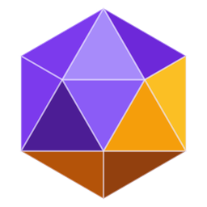

<div align="center">



# Icozinho

**O icosaendro de estimação que vive na barra de tarefas do Windows.**

**Versão 0.5.0**

</div>

O Icozinho é uma gema 3D, o icosaendro da marca MedusoDev, que mora em cima da
sua barra de tarefas. Ele rola de um lado para o outro, atravessa monitores,
repara quando o mouse chega perto, gosta de carinho, fica tonto se você
exagerar nas cutucadas e dorme quando você some.

É o sucessor do antigo `pet_taskbar_icosaendro`, refeito do zero: mais leve,
mais simples e com a gema igual à do [portfólio](https://gabrielbarros-portfolio.vercel.app).

## O que já existe

- **Vive na barra de tarefas**: uma faixa transparente sobre a barra, em todos
  os monitores. Cada monitor tem o próprio chão; se o do lado é mais baixo, ele
  cai e quica.
- **Rola de verdade**: anda girando pelo chão, sem deslizar, e para de vez em
  quando para descansar.
- **Curioso**: o mouse chegou perto, ele para e fica olhando para ele.
- **Cutucar**: um clique faz ele pular e girar. Três seguidos e ele fica tonto.
- **Arrastar e arremessar**: segure e leve para onde quiser; ao soltar, ele
  voa com a velocidade do arremesso, quica e se ajeita.
- **Carinho**: passe o mouse em vai-e-vem por cima dele e saem coraçõezinhos.
- **Tédio e sono**: sem ninguém mexendo, dá pulinhos; depois de 3 minutos,
  dorme (zzz). Chegar perto ou clicar acorda, assustado.
- **Bandeja**: abrir a doca, soltar ou prender o pet, iniciar com o Windows,
  ligar ao Claude Code e sair. Clique duplo no ícone abre a doca.
- **Clique atravessa**: só a gema captura o mouse; o resto da faixa não atrapalha
  o que está atrás.
- **Acompanha o Claude Code**: ligado pela bandeja, ele mostra num balão o que
  o Claude Code está fazendo em cada sessão (pensando, editando um arquivo,
  rodando um comando), pula chamando quando o Claude precisa de você, comemora
  quando termina e fica tonto se der erro. Vale para o terminal e para a aba
  Code do app Claude. Veja [Claude Code](#claude-code).
- **Aprova e responde pelo Icozinho**: quando o Claude Code pede permissão, um
  cartão na doca mostra o que ele quer fazer (o comando inteiro, o arquivo) com
  **Permitir**, **Negar** e **No terminal**. Perguntas de múltipla escolha
  aparecem com as opções como botões, uma por vez, e **Outro…** para responder
  escrevendo. Cutucar o pet com um pedido esperando abre a doca.
- **A doca**: escondida na borda direita da tela (ou na esquerda, ou no
  topo), como a barra de tarefas com "ocultar automaticamente". Escondida, é só
  um fio de luz na cor do que o Claude está fazendo (roxo trabalhando, âmbar
  precisando de você, verde pronto). Encoste o mouse na borda e sai uma aba com
  a gema; um clique abre o painel:
  - **Sessões**: todas as sessões abertas, com o estado e o passo de cada uma,
    e os pedidos de permissão e as perguntas esperando você
  - **Conversa**: um chat com o Claude, usando a sua assinatura (sem chave de
    API)
  - **Ajustes**: pet solto ou preso, lugar da doca, sons, iniciar com o Windows
    e a ligação com o Claude Code
  - **📌 Prender e soltar**: preso, o Icozinho sai da barra de tarefas e fica só
    na doca; solto, volta a passear
  Quando chega um pedido, o painel abre sozinho (sem roubar o foco de quem está
  digitando ou jogando) e toca um aviso.
- **Leve**: 30 quadros por segundo andando, 15 dormindo, 60 só quando está no ar
  ou recebendo carinho; escondido, não desenha nada.

## Claude Code

O Icozinho acompanha o Claude Code pelos **hooks**: a cada evento, o Claude Code
roda um retransmissor pequeno (`src/gancho/icozinho-gancho.js`), que entrega o
evento ao Icozinho por um canal local (named pipe), sem internet.

- **Para ligar:** bandeja → **Ligar ao Claude Code…**. Ele mostra exatamente o
  que vai entrar no `~/.claude/settings.json`, guarda uma cópia de segurança e
  só adiciona as entradas dele, sem mexer no resto.
- **Para desligar:** bandeja → **Desligar do Claude Code**. Sai só o que é dele.
- **Nunca trava o Claude Code:** se o Icozinho estiver fechado ou demorar mais
  de 0,3 s, o retransmissor sai em silêncio e o Claude Code segue normalmente.
- **Só decide com o seu clique:** sem resposta em 110 s, ou com "No terminal",
  o Claude Code pergunta no terminal como sempre. Se você responder no
  terminal, o cartão some sozinho. Respostas que não batem com a pergunta são
  descartadas.
- Quem ligou numa versão anterior vê **Atualizar ligação ao Claude Code…** na
  bandeja.
- Precisa do **Node** instalado (é ele que roda o retransmissor).

## Conversa

A aba Conversa da doca usa o próprio Claude Code em modo de comando
(`claude -p`), com o login da sua assinatura. Ele procura o `claude` do
terminal e, se não houver, usa o que vem dentro do app Claude (inclusive na
versão da Microsoft Store, que guarda os arquivos numa pasta virtualizada). A
conversa roda numa pasta só dela, longe dos seus projetos, e não aparece na
lista de sessões.

Quando ele precisa de permissão para rodar algo (fechar um programa, por
exemplo), o cartão com **Permitir** e **Negar** aparece ali mesmo, no meio da
conversa. Isso vem de um `settings.json` só da pasta da conversa, com um gancho
de permissão: vale para a conversa e para mais nada no seu computador. Sem
resposta em 110 s, o pedido é negado.

## Stack

- Electron (janela transparente e bandeja)
- Three.js (a gema, com material de gema e animação no shader)
- JavaScript puro, sem etapa de build

## Como rodar

```bash
git clone https://github.com/MedusoDev/icozinho_pet_taskbar.git
cd icozinho_pet_taskbar
npm install
npm start
```

Para gerar o instalador do Windows (`dist/`):

```bash
npm run dist
```

## Organização

```
src/
  main/         processo principal
    principal.js   janela, ciclo de vida e ponte com o pet
    canal.js       recebe os eventos do Claude Code
    ganchos.js     liga e desliga os hooks no settings.json do Claude Code
    sessoes.js     as sessões abertas, para a doca listar
    ilha.js        a janela da doca: borda, posição e tamanhos
    conversa.js    o chat, via claude -p
    pista.js       a faixa sobre a barra de tarefas, um chão por monitor
    bandeja.js     o ícone e o menu perto do relógio
    preferencias.js  o que ele lembra entre aberturas
  gancho/
    icozinho-gancho.js  o retransmissor que o Claude Code roda a cada evento
  compartilhado/
    passos.js      como descrever cada passo do Claude ("Editando pet.js")
  preload/
    ponte.js       o que o pet pode pedir ao processo principal
    ponte_ilha.js  o que a doca pode pedir ao processo principal
  ilha/         a doca da borda
    ilha.js        fio, aba, painel e modos
    cartao.js      o cartão de permissão e de pergunta
    conversa.js    a aba de chat
    sons.js        os avisos sonoros, sintetizados
  renderer/     o pet em si
    pet.js         cena, estado, modos e o relógio de cada quadro
    gema.js        o icosaendro da marca
    mouse.js       cutucar, arrastar e carinho
    chao.js        onde é o chão em cada ponto
    efeitos.js     corações, zzz e estrelinhas
    agente.js      o balão e as reações ao Claude Code
assets/         ícones do app, do instalador e da bandeja
```

---

Feito por [Gabriel Barros](https://github.com/MedusoDev).
